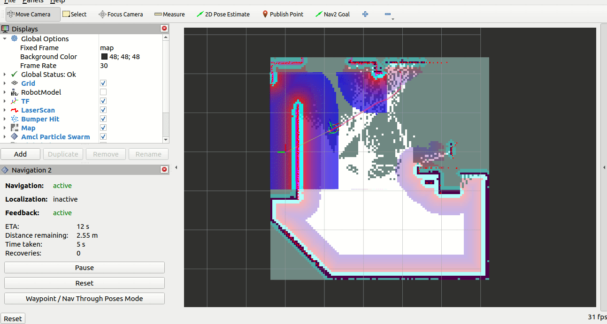
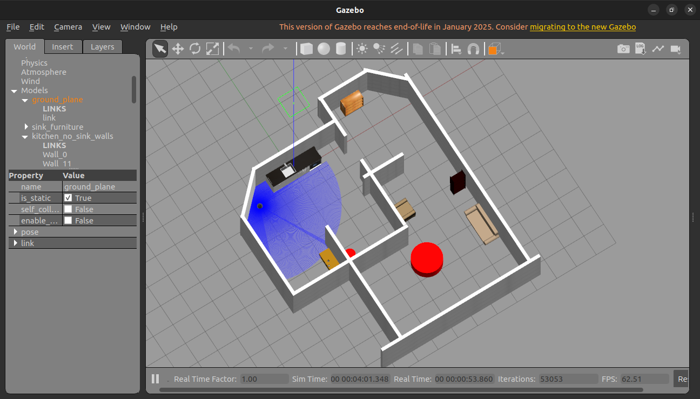

# 🐢 TurtleBot3 Autonomous Exploration Framework (ROS 2)


This repository provides a High-Level Behavior decision-making framework for autonomous exploration and mapping of unknown indoor environments. It was developed as a University Internship project at the **Alma Mater Studiorum - University of Bologna**.

The system replaces standard reactive or probabilistic approaches (such as *explore_lite* or *Wall Follower*) with a highly optimized **Frontier-Based** exploration algorithm. It is specifically designed to overcome common navigation bottlenecks, such as local minima traps and oscillatory behaviors ("ping-pong" effect) in structured environments with narrow passages.



## ✨ Key Features

- **Ultra-Fast Frontier Extraction:** Leverages the `NumPy` library to convert the 1D `OccupancyGrid` array provided by SLAM into a 2D matrix. By utilizing parallelized index shifting and logical operators, the algorithm instantly isolates frontier pixels (boundaries between free and unknown space), drastically reducing computational overhead compared to standard iterative loops.
- **"Long-Stride" Heuristic:** Mitigates fragmented movements by filtering out proximate micro-frontiers. The algorithm stochastically selects a target from the top 30% furthest valid frontiers. This forces the Nav2 Global Planner to generate long, fluid trajectories, maximizing LiDAR coverage speed and avoiding deterministic loops.
- **Robustness & Fault-Tolerance:** 
  - Implements a dynamic navigation timeout mechanism (e.g., 35s for exploration, 90s for homing).
  - If the Nav2 stack fails to reach a target due to unforeseen dynamic obstacles or narrow constraints, the goal is preempted and its coordinates are added to a **Blacklist**. Subsequent iterations geometrically filter out any new frontiers generated within a 0.6m radius of these unreachable zones.
- **Autonomous Task Completion (Homing & Auto-Save):** The node continuously evaluates the remaining frontier pixels. When this count falls below a predefined noise threshold, the robot transitions to an *Auto-Completion* state. It computes a homing trajectory to its initial startup coordinates, automatically serializes and saves the map (`.yaml` and `.pgm` files) via system calls, and performs a graceful shutdown.

## ⚙️ Prerequisites

The package has been developed and tested on **Ubuntu 22.04 LTS** with **ROS 2 Humble**.

- Navigation Stack: `nav2`
- Mapping: `slam_toolbox`
- Python Dependencies: `numpy`, `rclpy`
- Hardware/Simulation: TurtleBot3 (Burger/Waffle) or Gazebo Simulator.

## 🚀 Installation

1. Clone this repository into your ROS 2 workspace:
   ```bash
   cd ~/turtlebot_ws/src
   git clone <your_repo_url> ultimate_explorer
   ```

2. Install the required Python dependencies (if not already present):
   ```bash
   pip3 install numpy
   ```

3. Build the package:
   ```bash
   cd ~/turtlebot_ws
   colcon build --packages-select ultimate_explorer
   source install/setup.bash
   ```

## 🎮 Usage

Before running the exploration node, ensure that the robot (or Gazebo simulation), SLAM Toolbox, and Nav2 are actively running.

1. Launch your simulation/robot environment.
2. Launch SLAM and Nav2.
3. Run the exploration node:
   ```bash
   ros2 run custom_explorer custom_explorer
   ```
*(Note: Ensure the executable name matches the one defined in your `setup.py` entry points).*

The node will automatically wait for the `navigate_to_pose` Action Server to come online, register its current pose as "Home", and begin the autonomous exploration loop.

## 🛠️ Nav2 Parameter Tuning Recommendation

To achieve optimal performance (e.g., fully mapping the unibo world in ~14 minutes, as recorded during tests), it is highly recommended to tune the following parameters in your Nav2 Costmap configuration, especially for environments with narrow doors:

- `inflation_radius`: Reduced to **0.20** (prevents the planner from perceiving standard doors as completely obstructed paths).
- `cost_scaling_factor`: Adjusted to allow wider turns while effectively avoiding sharp corners.

## 📊 Results & Sim-to-Real Deployment

The architecture was extensively validated in a 3D Gazebo simulation ("Turtlebot3 Unibo" environment), demonstrating excellent planner performance and complete suppression of oscillatory behaviors. 

Initial Sim-to-Real deployment attempts on a physical TurtleBot3 Burger highlighted low-level OS infrastructure bottlenecks. Specifically, missing Wi-Fi drivers on the native Raspberry Pi OS (Ubuntu 22.04.5 LTS) prevented SSH and DDS (Data Distribution Service) communications. Future work will focus on resolving these hardware-layer constraints to fully validate the *Long-Stride* heuristic against real-world kinematic dynamics and sensory noise.



---
*Developed by Andrea Gallo - Alma Mater Studiorum, University of Bologna*